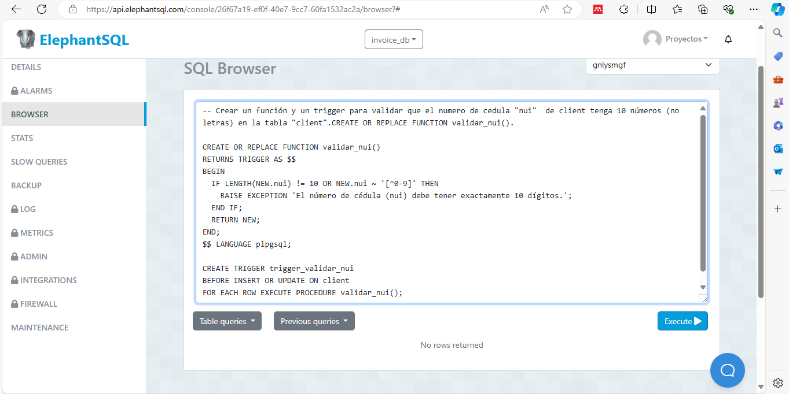
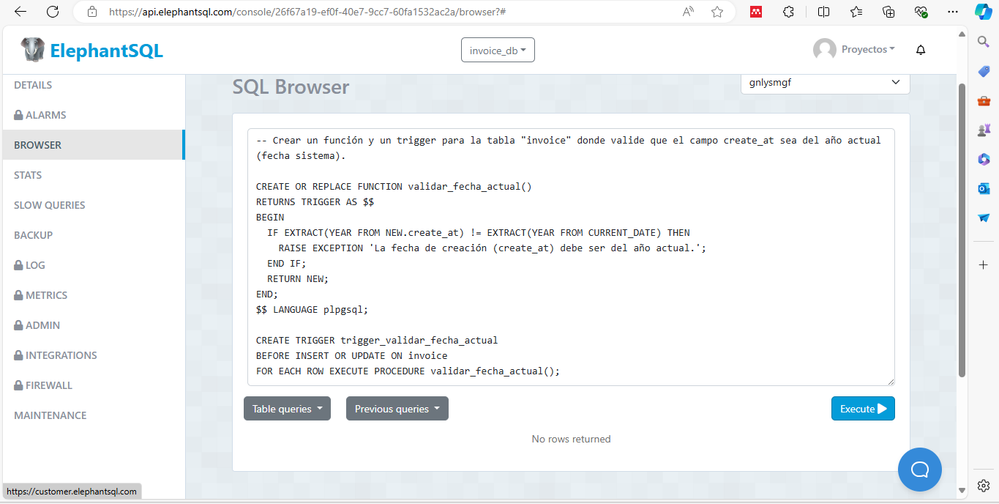
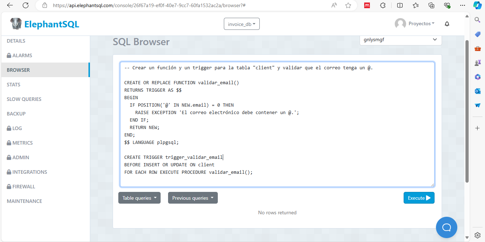

# TAS13 - Crear triggers
### 1. Crear un función y un trigger para validar que el numero de cedula "nui"  de client tenga 10 números (no letras) en la tabla "client".CREATE OR REPLACE FUNCTION validar_nui().
  - Sentencia:
  ```
  CREATE OR REPLACE FUNCTION validar_nui()
  RETURNS TRIGGER AS $$
  BEGIN
  IF LENGTH(NEW.nui) != 10 OR NEW.nui ~ '[^0-9]' THEN
    RAISE EXCEPTION 'El número de cédula (nui) debe tener exactamente 10 dígitos.';
  END IF;
  RETURN NEW;
  END;
  $$ LANGUAGE plpgsql;

  CREATE TRIGGER trigger_validar_nui
  BEFORE INSERT OR UPDATE ON client
  FOR EACH ROW EXECUTE PROCEDURE validar_nui();
  ```
  - Captura:



## 2. Crear un función y un trigger para que cada vez que se inserte un nuevo registro en la tabla "detail" se disminuya el stock de la tabla "product".
  - Sentencia:
  ```
  CREATE OR REPLACE FUNCTION disminuir_stock()
  RETURNS TRIGGER AS $$
  BEGIN
  UPDATE product
  SET stock = stock - NEW.quantity
  WHERE id = NEW.productid;
  RETURN NEW;
  END;
  $$ LANGUAGE plpgsql;

  CREATE TRIGGER trigger_disminuir_stock
  AFTER INSERT ON detail
  FOR EACH ROW EXECUTE PROCEDURE disminuir_stock();
  ```
  - Captura:


## 3. Crear un función y un trigger para la tabla "invoice" donde valide que el campo create_at sea del año actual (fecha sistema).
  - Sentencia:
  ```
  CREATE OR REPLACE FUNCTION validar_fecha_actual()
  RETURNS TRIGGER AS $$
  BEGIN
  IF EXTRACT(YEAR FROM NEW.create_at) != EXTRACT(YEAR FROM CURRENT_DATE) THEN
    RAISE EXCEPTION 'La fecha de creación (create_at) debe ser del año actual.';
  END IF;
  RETURN NEW;
  END;
  $$ LANGUAGE plpgsql;

  CREATE TRIGGER trigger_validar_fecha_actual
  BEFORE INSERT OR UPDATE ON invoice
  FOR EACH ROW EXECUTE PROCEDURE validar_fecha_actual();
  ```
  - Captura:



## 4. Crear un función y un trigger para la tabla "client" y validar que el correo tenga un @.
  - Sentencia:
  ```
  CREATE OR REPLACE FUNCTION validar_email()
  RETURNS TRIGGER AS $$
  BEGIN
  IF POSITION('@' IN NEW.email) = 0 THEN
    RAISE EXCEPTION 'El correo electrónico debe contener un @.';
  END IF;
  RETURN NEW;
  END;
  $$ LANGUAGE plpgsql;

  CREATE TRIGGER trigger_validar_email
  BEFORE INSERT OR UPDATE ON client
  FOR EACH ROW EXECUTE PROCEDURE validar_email();
  ```
  - Captura:

